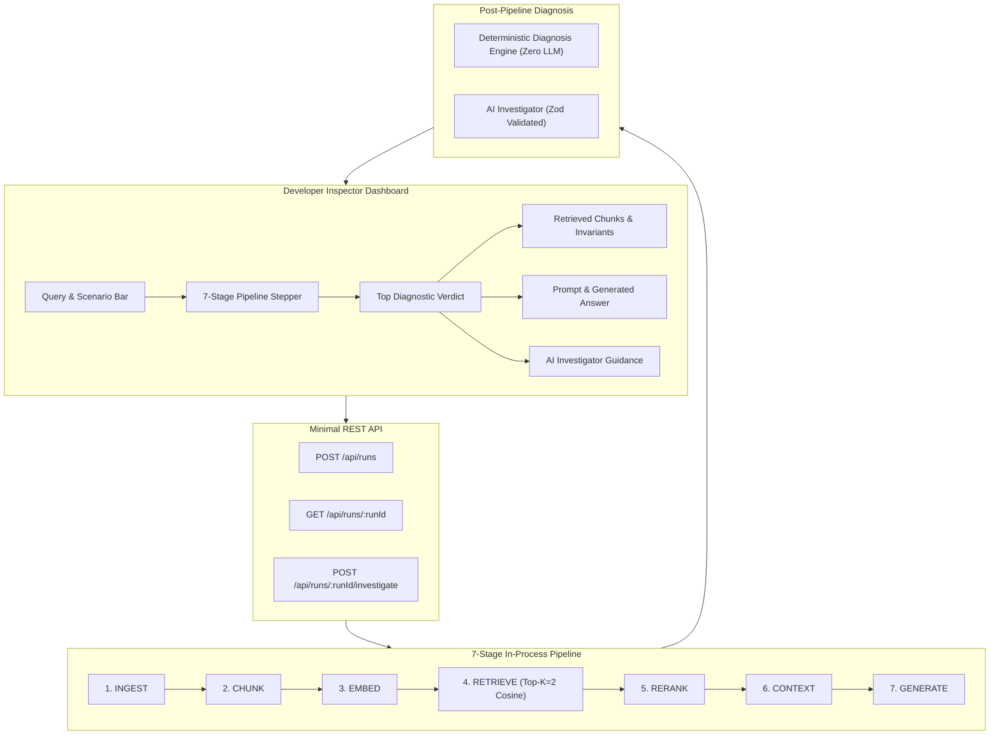

# Abstrabit RAG Inspector

A developer-focused RAG debugging and inspection tool that executes an end-to-end RAG pipeline, records canonical structured traces, deterministically pinpoints retrieval failures, and provides grounded AI explanations to guide engineering fixes.

> **Core Principle**: **Deterministic system logic decides WHAT HAPPENED. AI explains WHAT IT MEANS.**

---

## 1. Why RAG Debugging Is Difficult

When a RAG system generates an incorrect or incomplete answer, developers typically ask:
> *"Did the LLM hallucinate, or did the retrieval stage fail to provide the right evidence?"*

Traditional chat interfaces obscure the intermediate pipeline stages. Developers waste hours tweaking prompts when the true root cause was a chunk boundary omission or dense retrieval scoring mismatch.

**Abstrabit RAG Inspector** makes every stage observable:
1. **What happened** at each RAG stage (latency, status, metrics).
2. **What evidence** was retrieved vs expected.
3. **Where the pipeline failed** (retrieval vs context vs generation).
4. **Why the failure occurred** (keyword density vs semantic coverage).
5. **What engineering action** will fix it.

---

## 2. System Architecture



---

## 3. The 7 Pipeline Stages vs Separate Diagnosis

The application explicitly tracks **7 RAG execution stages** and a dedicated **post-pipeline diagnosis**:

- **`INGEST`**: Loads the synthetic Acme Corporation Global Employee Handbook (8 structured sections).
- **`CHUNK`**: Segments document into 8 distinct section chunks with token counts and metadata.
- **`EMBED`**: Generates 64-dimensional dense vectors in-process using normalized term & phrase weighting.
- **`RETRIEVE`**: Executes in-process cosine similarity. Under $K=2$, ranks the distractor submission guidelines (`chunk_003`) and PTO policy (`chunk_005`) above the split entitlement policy (`chunk_004`), emitting a `WARNING`.
- **`RERANK`**: Re-scores candidate chunks with query proximity bonuses.
- **`CONTEXT`**: Assembles prompt context, flagging incomplete evidence coverage.
- **`GENERATE`**: Synthesizes the response strictly based on provided context.
- **`DIAGNOSE` (Post-Pipeline)**: Deterministically flags `MISSING_RELEVANT_CHUNK` and sends the canonical trace to the AI Investigator.

---

## 4. Primary Demo Scenario: Reproducible Retrieval Failure

- **Corpus**: Synthetic "Acme Corporation Global Employee Handbook"
- **Query**: `"What is the company's parental leave policy?"`
- **Root Cause**: The authoritative policy statement (*26 weeks of paid leave*) is split into `chunk_004`, while `chunk_003` contains repetitive phrases for *"parental leave policy guidelines and application rules"*.
- **Result**: Dense cosine similarity naturally scores `chunk_003` (0.89) higher than `chunk_004` (0.71). Under top-$K=2$, `chunk_004` is omitted, causing the generator to state that duration details are absent from context.
- **Verdict**: The inspector highlights **`RETRIEVAL FAILURE`** with high confidence, rather than blaming the LLM.

---

## 5. Tech Stack

- **Framework**: [Next.js 14](https://nextjs.org/) (App Router, React 18, TypeScript)
- **Styling**: [Tailwind CSS](https://tailwindcss.com/) with Abstrabit design tokens (light mode default, `#8B5CF6` purple accents, `#010614` dark mode)
- **Vector Engine**: In-process dense vector math (normalized cosine similarity, zero external database dependencies)
- **Validation**: [Zod](https://zod.dev/) schema validation
- **Testing**: Node.js native test runner (`node --test`)
- **Icons**: Lucide React

---

## 6. Quickstart & Local Setup

### Prerequisites
- Node.js 20+ or 22+

### Installation & Run
```bash
# 1. Navigate into project directory
cd Abstrabit-RAG-Inspector

# 2. Install dependencies
npm install --no-audit --no-fund --prefer-offline

# 3. Run development server
npm run dev

# 4. Open in browser
# http://localhost:3000
```

### Running Tests & Build Checks
```bash
# Run unit & integration tests
npm test

# Run TypeScript type check
npx tsc --noEmit

# Run production build
npm run build
```

---

## 7. Environment Configuration

Copy `.env.example` to `.env.local` if you wish to configure a live LLM:

```bash
# Demo Mode requires ZERO external services or API keys (default: true)
DEMO_MODE=true

# Optional: Set for live OpenAI-compatible LLM
OPENAI_API_KEY=
OPENAI_BASE_URL=https://api.openai.com/v1
OPENAI_MODEL=gpt-4o-mini
```

---

## 8. 90–120 Second Demo Loom Walkthrough Script

| Time | Action | Speaking Points |
| :--- | :--- | :--- |
| **0:00 - 0:25** | Open Dashboard (`localhost:3000`) in Light Mode | *"When RAG systems fail, developers struggle to identify whether the prompt, LLM, or retrieval failed. Abstrabit RAG Inspector makes every stage observable."* |
| **0:25 - 0:45** | Click **Run Inspection** or **Replay Pipeline** | *"Watch the 7 execution stages: Ingest, Chunk, Embed, Retrieve, Rerank, Context, Generate. Notice the amber alert triggered at the RETRIEVE stage."* |
| **0:45 - 1:10** | Highlight **Top Diagnostic Banner** & **Retrieved Chunks** | *"The deterministic diagnosis engine pinpoints `MISSING_RELEVANT_CHUNK`. Expected authoritative chunk `chunk_004` was omitted because distractor `chunk_003` had higher keyword overlap."* |
| **1:10 - 1:30** | Show **Prompt / Answer** & **AI Guidance** | *"Because context omitted chunk_004, the generator hedged that leave duration was missing. The AI Investigator grounded its explanation in trace event IDs and recommended adjusting chunk boundaries or increasing top-K to 4."* |
| **1:30 - 1:50** | Click a stage chip & toggle Dark Mode | *"Developers can click any stage to inspect raw microsecond metrics and JSON payloads, or toggle dark mode for technical workstation use."* |

---

## 9. Invariants & Trace Integrity

The inspector continuously validates trace integrity:
- Exactly 7 sequential pipeline events emitted per run.
- Zero missing, duplicate, or out-of-order stage transitions.
- Authoritative ground-truth chunk tracking ($0 / 1$ retrieved in failure scenario).
- Strict separation between deterministic facts and AI interpretation.
