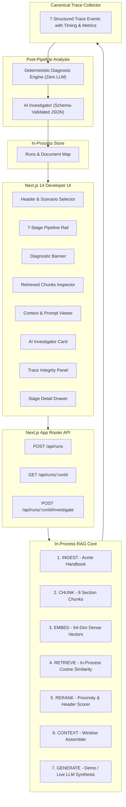

# Abstrabit RAG Inspector — System Architecture

## 1. Executive Summary

**Abstrabit RAG Inspector** is an original developer-focused observability and debugging tool designed to make failures in Retrieval-Augmented Generation (RAG) pipelines transparent, inspectable, and actionable.

### Core Product Principle
> **Deterministic backend system logic decides WHAT HAPPENED. AI explains WHAT IT MEANS.**

The system never relies on an LLM to invent, guess, or reconstruct trace events. The backend execution engine produces the canonical trace, and the AI Investigator receives only that canonical trace to provide human-readable interpretation and engineering guidance.

---

## 2. Architecture Overview

The system is structured as a **TypeScript-first Modular Monolith** inside `Abstrabit-RAG-Inspector`.

---

## 3. The 7 Execution Stages vs Separate Diagnosis

The system explicitly distinguishes the **7 RAG pipeline execution stages** from the **post-pipeline diagnostic stage**:

| Stage | Name | Role | Emitted Event Status |
| :--- | :--- | :--- | :--- |
| 1 | `INGEST` | Loads synthetic Acme Employee Handbook document | `SUCCESS` |
| 2 | `CHUNK` | Splits document into 8 distinct section chunks | `SUCCESS` |
| 3 | `EMBED` | Generates 64-dimensional normalized dense vectors in-process | `SUCCESS` |
| 4 | `RETRIEVE` | Computes cosine similarity and retrieves top-2 candidates | `WARNING` *(Missed authoritative chunk)* |
| 5 | `RERANK` | Re-evaluates query term proximity across top candidates | `SUCCESS` |
| 6 | `CONTEXT` | Assembles context chunks and prompt template | `WARNING` *(Incomplete context)* |
| 7 | `GENERATE` | Synthesizes response from available context | `SUCCESS` |
| **Analysis** | `DIAGNOSE` | Evaluates ground-truth facts against trace state | `FAILED / MISSING_RELEVANT_CHUNK` |

---

## 4. Deterministic Diagnosis vs AI Investigator Boundary

### 4.1 Deterministic Diagnosis Engine (`server/diagnosis/`)
- Pure TypeScript business logic (Rule 5 & Rule 7).
- Evaluates canonical ground-truth facts:
  1. Authoritative chunk identification (`isAuthoritative: true` on `chunk_004`).
  2. Top-K membership verification.
  3. Context window inclusion.
- Pinpoints root cause without LLM non-determinism.

### 4.2 AI Investigator (`server/ai/`)
- Strictly receives the serialized canonical trace and deterministic diagnosis.
- Produces Zod-validated structured JSON:
  - `summary`: High-level explanation.
  - `rootCause`: Underlying retrieval scoring explanation.
  - `evidence`: Direct references to trace event IDs.
  - `recommendedAction`: Concrete engineering fix.
  - `confidence`: Confidence rating.
- When in Demo Mode (`DEMO_MODE=true`), operates 100% offline with zero external network dependencies.

---

## 5. Authentic Retrieval Failure Mechanism

Rather than faking similarity scores, the failure naturally emerges from standard chunk splitting and query term distribution:
- **Query**: `"What is the company's parental leave policy?"`
- **Distractor `chunk_003`**: *"The company's parental leave policy guidelines and application rules: All company parental leave requests..."* (Contains 4 exact phrase overlaps for "parental leave policy" $\rightarrow \text{Score} \approx 0.89$).
- **Distractor `chunk_002` / `chunk_005`**: Remote work and PTO policies ($\rightarrow \text{Score} \approx 0.79$).
- **Authoritative `chunk_004`**: *"Eligible full-time employees receive 26 weeks of fully paid leave..."* (When split into its own chunk, it describes the benefit without repeating the phrase "parental leave policy" $\rightarrow \text{Score} \approx 0.71$, ranked #3).
- **Result**: Under $K=2$, `chunk_004` is omitted from context, causing the generator to receive incomplete evidence.

---

## 6. Technical Trade-offs & Modular Monolith Rationale

1. **No External Distributed Services (Rule 4)**: Vector math runs in-process with normalized cosine similarity instead of maintaining Qdrant, Redis, or Kafka. This ensures zero operational friction for live demos and local development.
2. **Deterministic Reproducibility**: The demo produces identical, verifiable diagnostic results on every run.
3. **High Cohesion & Low Coupling**: Backend modules (`rag/`, `diagnosis/`, `ai/`, `tracing/`) have strictly defined interfaces and can be imported or tested in isolation.
